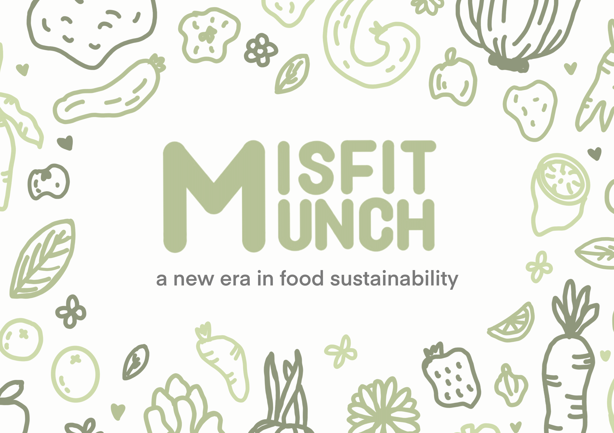

# Misfit Munch



**Misfit Munch** is a transformative platform designed to tackle the global challenge of food wastage, particularly targeting "ugly" or "wonky" produce. By bridging farmers and consumers, we ensure that produce otherwise dismissed due to its appearance finds its rightful place in our kitchens and plates, rather than being wasted.


## Features

1. **For Farmers**: An exclusive marketplace to showcase and sell their produce, regardless of its appearance.
2. **For Users**: A modern, efficient approach to meal planning:
    - **Fridge Scan**: Snap a photo of your fridge, and let our algorithm label the contents using the Google Cloud Vision API.
    - **Recipe Crafting**: Based on your fridge's content and our farmer partnerships, OpenAI ChatGPT API serves up tailored recipes.
    - **One-Click Purchase**: Fancy a recipe? Get all the ingredients with a single click, bypassing piecemeal shopping.

## Demo

### App Layout


### AI Layer Explained


## Technology Stack

- Backend: Flask, SQLite
- Image Recognition: Google Cloud Vision API, DeepLabV3
- Recipe Crafting: OpenAI ChatGPT API
- Frontend: HTML, CSS, Javascript

## Installation & Setup

```bash
# Clone the Repository
git clone <github_repo_link>
cd <repository_name>

# Setup Virtual Environment (Optional but Recommended)
python3 -m venv venv
source venv/bin/activate  # On Windows use `venv\Scripts\activate`

# Install Dependencies
pip install -r requirements.txt

# Setup Google Cloud Credentials
export GOOGLE_APPLICATION_CREDENTIALS="/path/to/your/keyfile.json"

# Run the Application
flask run

# Open the application in your preferred browser at
http://127.0.0.1:5000/
```

## Contributors

### **Fuka Ikeda**: 
- *Brown 26' Design Engineering*
- Hardware Design + UI/UX

### **Marco Qin**: 
- *Brandeis 24' CS+Math*
- Backend + AI

### **Mahmoud Salah**: 
- *Brandeis 24' CS+Math*
- Frontend + Backend + AI

### **Omari Emmanuel**: 
- *Queen's 26' Data Analytics*
- Content Creation + Frontend


## Future Direction

Misfit Munch is not merely a solution; it's a revolution. We aim to continue refining our platform, actively contributing to the nexus between reducing food wastage and promoting healthier eating.
